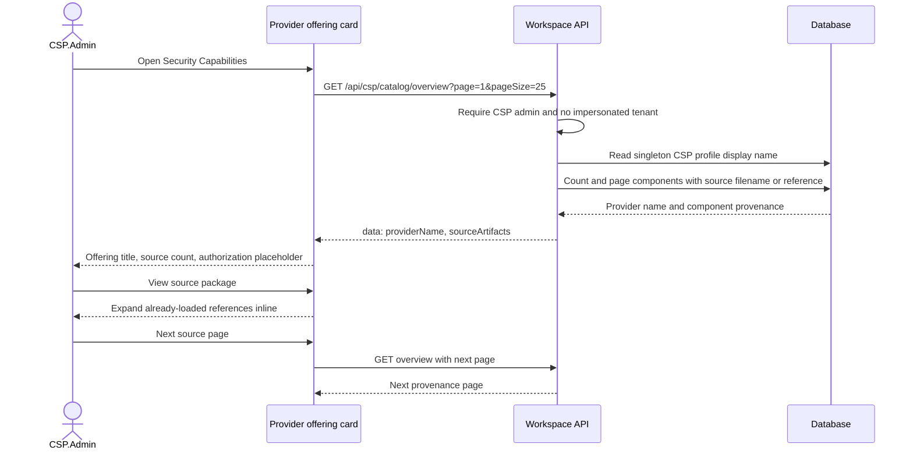
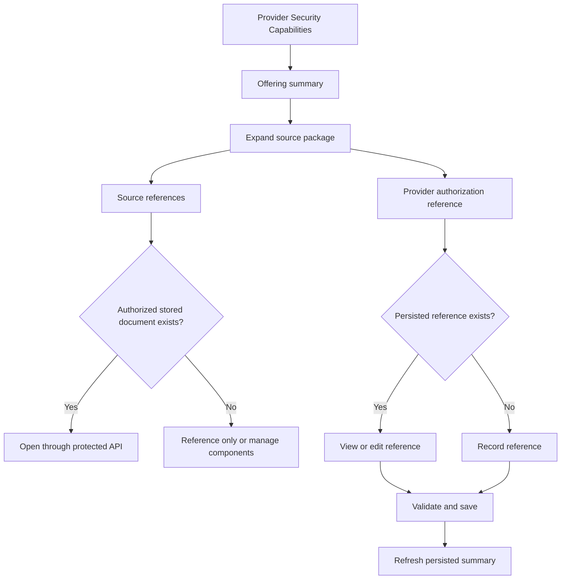
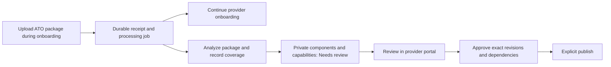

# Provider offering / source package — UI and API flow

Status: proposed completion for user approval. Source audit: 2026-09-23, current working checkout (including uncommitted work). This is a design document, not an implemented feature or a deployed verification result.

Scope: the highlighted offering card on Provider workspace → Security Capabilities.

## What exists today

- The button toggles an inline panel. It does not navigate, upload, download, or request authorization metadata.
- Each row displays filename (or component name), format, and source reference as text.
- “Not recorded” means no component with a nonblank filename/reference was returned by this query. It does not prove no source documents exist elsewhere.
- The count is component provenance rows, not distinct files or versioned packages. One imported document can therefore appear through multiple components.
- “Authorization record: Not recorded · separate from publication” is hardcoded in the UI. It is not a lookup result for an authorization decision.
- Loading, failure/retry, empty results, and pagination are present in the source. Runtime behavior was not exercised in this review.

Current response fields: `providerName`; `sourceArtifacts.items[]` containing `componentId`, `componentName`, `sourceFormat`, `sourceFileName`, `sourceReference`; and pagination fields `page`, `pageSize`, `total`. The TypeScript overview also declares `authorizationRecord: null`; the card does not consume it.

## Proposed UI flow for approval

Retain the compact card and inline expansion. Avoid a separate full-screen package editor for this first increment.

1. **Collapsed card:** provider name; “N source references” (accurate for the existing count); authorization state obtained from persisted metadata when available; “View source package”.
2. **Expanded panel:** two labeled sections, **Source documents** and **Provider authorization reference**. Keep the statement that source material and capability publication do not grant a mission system authorization.
3. **Source documents:** show filename, format, associated component, and reference. Provide **Open document** only when the server can resolve an authorized stored artifact; otherwise show “Document unavailable; reference only”. Do not turn arbitrary stored strings into download URLs.
4. **Empty source section:** “No source references recorded.” Provide **Manage provider components** as the first increment's path to existing authoring. Add an import action only after its publication side effects are addressed below.
5. **Authorization section:** show “Not recorded” only after a successful lookup with no record. Otherwise show reference title, authority, decision date, expiration when recorded, and source document. Use **Record authorization reference** / **Edit reference** for authorized provider administrators. Label this as recording an existing decision, not issuing an ATO.
6. **Save reference:** validate fields → save with concurrency protection → refresh card and panel → display persisted result. Cancel preserves the previous record. A conflict requires reload/review; failure preserves entered values.
7. **Failures:** show source and authorization errors independently; retain retry actions. Access denial must not masquerade as an empty package. Keyboard focus remains predictable on expand/collapse and returns to the initiating action when a dialog closes.

## API design

The following new routes are proposals, not verified existing endpoints. Scope them to the current provider identity resolved server-side; reject tenant impersonation and enforce authentication/authorization on every request.

| UI action | API | Status / behavior |
|---|---|---|
| Load card / page references | `GET /api/csp/catalog/overview?page=1&pageSize=25` | Exists. Retain component-reference counting until a real artifact identity supports deduplication. |
| Load authorization section | `GET /api/csp/catalog/authorization-reference` | Proposed. Return `{ data: null }` when not recorded; otherwise persisted reference plus concurrency token. |
| Record or edit reference | `PUT /api/csp/catalog/authorization-reference` | Proposed. Validate reference and provider ownership, enforce expected revision, audit actor and changes, return saved representation. |
| Open a stored source | `GET /api/csp/catalog/source-artifacts/{artifactId}/content` | Proposed. Requires stable artifact identity/storage resolution first; authorize metadata and content independently. Return content or a short-lived authorized URL. |
| Import source documents | `POST /api/csp/inherited-components/import` | Exists outside this card; multipart files. Do not wire it as a passive attachment action. |

Proposed authorization-reference fields: reference title, issuing authority, decision date, optional expiration, source artifact ID or approved external reference, and expected revision. Exact relationship to existing authorization records must be resolved under the provider-baseline/system-ATO contract before implementation. Do not create a parallel system ATO model.

Proposed errors: invalid fields `400`; unauthenticated `401`; unauthorized `403`; missing artifact `404`; stale revision `409`. A failed lookup is an unavailable state, never “Not recorded”. Keep the workspace `{ data: ... }` success / structured error convention.

## Important integration boundary

The existing post-onboarding import endpoint checks CSP admin and active onboarding, parses/extracts/maps documents, then queries **all Draft components for the provider** and sets them to Published. This is component visibility publication, distinct from capability revision publication. Connecting it to a simple “Add source document” button would have broader effects than the label suggests, including other draft components.

Recommendation: approve the read/reference-management flow first. Before adding import here, explicitly design import-scoped publication behavior and review the underlying pipeline's persistence/error handling. Do not imply a successful upload verifies evidence or authorizes a system.

## Source evidence and design guidance

- `src/Ato.Copilot.Dashboard/src/features/workspace-operations/ProviderPresentation.tsx`, `ProviderOfferingSummary` and `ProviderArtifacts`: card and expand behavior.
- `src/Ato.Copilot.Dashboard/src/features/workspace-operations/api.ts`, `getProviderCatalogOverview`: request path and page size.
- `src/Ato.Copilot.Mcp/Endpoints/Workspaces/WorkspaceOperationsEndpoints.cs`, `GetProviderCatalogOverviewAsync`: route and access guard.
- `src/Ato.Copilot.Core/Services/Workspaces/WorkspaceOperationsService.ProviderCatalog.cs`, `GetProviderCatalogOverviewAsync`: profile lookup, provenance predicate, sorting and counts.
- `src/Ato.Copilot.Core/Models/Tenancy/CspInheritedComponent.cs`: component-owned source metadata, not a package entity.
- `src/Ato.Copilot.Mcp/Endpoints/Csp/CspInheritedComponentEndpoints.cs`, `ImportAsync`: existing import behavior and publication boundary.
- `specs/078-role-aware-workspaces/ui-issue-drafts/02-provider-catalog.md`, **Screen behavior** and **API, data and permission contract**: expandable source panel, authorized artifact access, distinct publication/authorization concepts.
- `specs/078-role-aware-workspaces/dependencies.md`: recorded dependency on provider baseline versus system ATO contract (#1023). External issue state was not checked.

## Approval and validation

Approval requested for the proposed inline UI, protected document access, and persisted authorization-reference workflow. This does not authorize implementation of import/publication changes.

Guidance compliance for this document: PASS — source-backed findings; document-before-fix; explicit existing/proposed distinction; no external writes; existing working changes preserved. Implementation readiness: pending approval and resolution of the authorization/artifact contracts. No new feature/user-story declaration or GitHub issue was created.

Architecture decision: extend the current provider card using component provenance and a separately governed authorization reference. Do not reinterpret catalog releases as authorization or assume a first-class package already exists.

Changes: this document only. No application code or TypeScript changed; build/test commands were not run for this documentation-only proposal. Rollback: remove this document.

Manual review now: open Provider workspace → Security Capabilities, expand the card, inspect the empty/populated state and later pages if present; compare with the existing-flow diagram. Proposed controls will not appear until implemented.

Implementation acceptance after approval: synthetic empty/populated/multipage records; duplicate source references across components; failed source and authorization reads; unauthorized/impersonated access; inaccessible artifact; valid save and stale revision; keyboard/mobile behavior; no system-ATO or capability-release changes. Add failing-first tests, update spec/plan/tasks/architecture documentation and issue traceability, run required .NET and Dashboard checks, and provide a local manual test before declaring implementation complete.

## Revised scope: onboarding package ingestion and portal approval

User direction, 2026-09-23: source-package ingestion belongs in CSP onboarding. Analyze the whole package, create components and capabilities, and present the resulting records for approval in the portal rather than listing them in the wizard. This supersedes the earlier recommendation to defer import from this design scope. The deliverable remains an approval-stage flow and mock; application behavior is not yet changed.

### Intended journey

1. **Onboarding — upload package:** accept an archive or a set of supported source documents as one package. Store the original source and manifest durably before confirming receipt. Show package name, file-processing coverage, status, and exceptions only; do not show component/capability inventories or require their review in onboarding.
2. **Continue onboarding:** after durable upload receipt, processing can continue in the background. Finalizing the provider profile does not approve or publish extracted records. Keep the wizard's existing optional-upload behavior unless separately changed.
3. **Package analysis:** enumerate every entry, including nested package contents within configured limits; inspect all supported document content (pages, sections, tables, worksheets, structured records and available attachments), not just names or headings. Extract source-supported components, capabilities, their relationships, control mappings and responsibility candidates across the package. Record duplicate/overlapping candidates for resolution. File contents are untrusted evidence, never workflow instructions.
4. **Coverage accounting:** every entry has a manifest status: processed, unsupported, unreadable, failed, or explicitly excluded with a reason. Empty results are distinct from failed extraction. Unsupported/encrypted/scanned content requiring unavailable processing produces an actionable exception; never claim the entire package was analyzed when it was not. Retain source path, artifact identity and page/section/row citations for each candidate.
5. **Portal — Security Capabilities → Review imports:** show the package and its processing state, counts, coverage exceptions and links to source documents. All generated components and capabilities start with review state **Needs review** and remain unpublished. Mapping confidence is advisory and cannot approve a record.
6. **Review:** inspect supporting evidence, correct or reject candidates, resolve duplicate matches and linked-component dependencies, and review responsibility/control mappings. Provide capability and component views with review filters. Existing published versions remain available while imported changes are staged separately.
7. **Approval:** approve exact reviewed revisions and their dependency set. Missing evidence, unresolved duplicate relationships, or unreviewed records block approval of that set. Coverage exceptions must be resolved or explicitly excluded with recorded rationale; exclusions remain visible and never convert partial processing into a full-coverage claim. Authorized subset approval must exclude affected candidates and all their unresolved dependencies.
8. **Publication:** a separate explicit Publish action releases only the approved set, using the existing exact-revision/impact-preview/idempotency concepts. Editing approved content invalidates its approval. Provider profile activation, upload completion, high confidence, and mapping success never publish records. Customer subscriptions can use only eligible published releases.

### State and API changes proposed

Keep processing, review, and publication separate:
- Package processing: Received → Processing → Ready for review / Needs attention / Failed.
- Candidate review: Needs review → Approved / Rejected; edits reset approval.
- Visibility: Unpublished → Published only after explicit approval and publication.

Existing `POST /api/csp/onboarding/atos/upload` currently performs synchronous parsing/extraction/mapping. Proposed evolution: durable acceptance returning `202` with `packageId` and `operationId`, followed by an operation status endpoint. Coordinate the frontend and contract migration; do not silently change the current response schema.

Proposed new routes, not implemented:
- `GET /api/csp/package-imports/{packageId}`: package/operation status, manifest coverage and exception counts; usable by the authorized admin during onboarding and after activation.
- `GET /api/csp/package-imports/{packageId}/candidates`: paged component/capability review records and citations, filterable by type/review state.
- `POST /api/csp/package-imports/{packageId}/retry`: resume failed processing with idempotency; preserve previously reviewed records and flag changed analysis for new review.
- `POST /api/csp/package-imports/{packageId}/approval-previews`: validate the selected candidate revisions, contributor dependencies, coverage exceptions and publication impact.
- `POST /api/csp/package-imports/{packageId}/approve`: persist approval bound to the validated set and preview hash.
- `POST /api/csp/package-imports/{packageId}/publish`: publish only the still-approved set with revision checks and an idempotency key; integrate with existing release services rather than introduce competing publication logic.

Candidate edits/rejection must reuse existing authoring contracts where suitable; their compatibility has not been fully audited. New package/artifact identity, durable jobs, revision-scoped review and coverage records require a formal implementation plan. Record authorization metadata extracted from the package as unconfirmed candidates until reviewed; an uploaded decision letter never grants a tenant system ATO.

Enforce provider ownership and CSP administrator authorization server-side; reject impersonated access to provider review/mutation operations. Subscriber APIs must not expose unpublished candidates or source bodies. Persist audit records for upload, processing exceptions, edits, approvals and publication. Retry must not duplicate candidates or publish unrelated drafts.

### Verified implementation gaps

- `CspOnboardingEndpoints.PostSubmitAsync` calls profile submission and then changes every Draft component for that profile to Published. This must be removed from onboarding completion under the revised requirement.
- `CspInheritedComponentEndpoints.ImportAsync` similarly publishes all provider Draft components after a post-onboarding import. Both ingress paths must converge on the same review gate.
- `CspAtoUploadHelpers.OrchestrateAsync` iterates supplied files, persists extracted components, then persists both Mapped and NeedsReview capability results. It is not a durable background package job.
- `CspAtoDocumentParser.ParsePdfAsync` projects the SSP system-name field as a single candidate. DOCX uses delimited paragraphs; XLSX looks for component/name and description headers; OSCAL reads the system-implementation component array. This is not comprehensive cross-document capability extraction.
- `ParseZipAsync` dispatches recognized entries, skips unsupported entries and catches some per-entry failures with a debug log. Nested ZIP entries are not dispatched by `GuessContentType`. The API does not expose a complete per-entry coverage manifest through this parser.
- `AtoDocumentsStep` renders extraction results and `ReviewStep` displays mapping tallies. The revised wizard should emphasize receipt/processing/attention status and move record-level decisions to the portal.

### Approval mock and acceptance

Open [Onboarding → portal review mock](provider-source-package-mocks/onboarding.html). All processing, approvals and publication in it are simulations.

Required implementation checks: onboarding completion leaves all candidates unpublished; high-confidence results still need approval; source coverage reports every entry; job survives browser closure; failed/unsupported files are visible; retries do not duplicate records; approved subsets cannot include unresolved dependencies; stale approval/preview blocks publication; changing a reviewed revision resets approval; repeated publish is idempotent; unrelated drafts and prior published versions remain unchanged; customer APIs cannot access unpublished records. Test both onboarding and later imports with synthetic mixed-format packages. Full specification, issue traceability and implementation remain pending, not claimed complete by this design revision.
