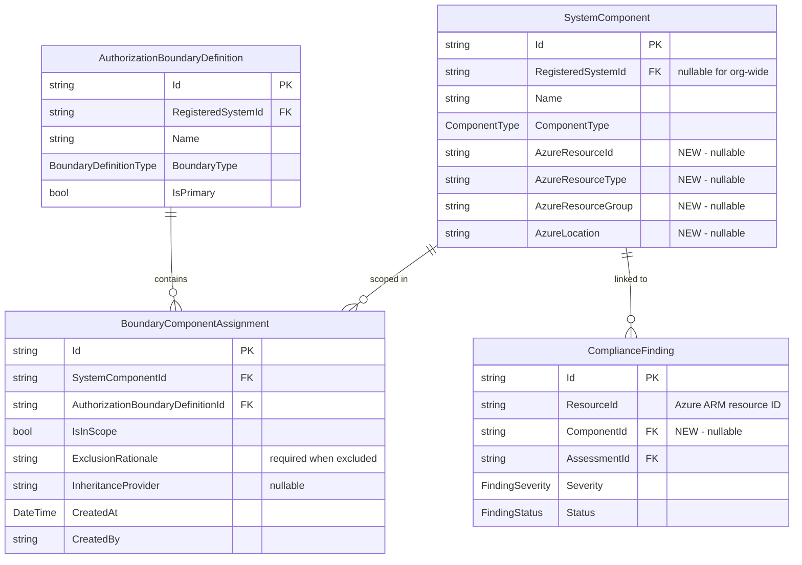

# Data Model: Component-Centric Boundary Model

**Feature**: 040-component-centric-boundary  
**Date**: 2026-03-19  
**Depends on**: [research.md](research.md) (R1, R4, R5)

---

## Entity Changes Overview

| Entity | Action | Description |
|--------|--------|-------------|
| `SystemComponent` | MODIFY | Add 4 Azure resource fields |
| `BoundaryComponentAssignment` | NEW | Join entity for boundary-component scope |
| `ComplianceFinding` | MODIFY | Add optional `ComponentId` FK |
| `AuthorizationBoundary` | DEPRECATE | Mark read-only; no new inserts |
| `AuthorizationBoundaryDefinition` | MODIFY | Add navigation to `BoundaryComponentAssignment` |

---

## New Entity: BoundaryComponentAssignment

```csharp
namespace Ato.Copilot.Core.Models.Compliance;

/// <summary>
/// Links a <see cref="SystemComponent"/> to an <see cref="AuthorizationBoundaryDefinition"/>
/// with per-boundary scope status (In Scope or Excluded).
/// Replaces the scope-tracking role of <see cref="AuthorizationBoundary"/>.
/// </summary>
public class BoundaryComponentAssignment
{
    [Key]
    [MaxLength(36)]
    public string Id { get; set; } = Guid.NewGuid().ToString();

    /// <summary>FK to the component.</summary>
    [Required]
    [MaxLength(36)]
    public string SystemComponentId { get; set; } = string.Empty;

    /// <summary>FK to the boundary definition.</summary>
    [Required]
    [MaxLength(36)]
    public string AuthorizationBoundaryDefinitionId { get; set; } = string.Empty;

    /// <summary>true = in scope, false = excluded from boundary.</summary>
    [Required]
    public bool IsInScope { get; set; } = true;

    /// <summary>Required when IsInScope is false. Explains why the component is excluded.</summary>
    [MaxLength(1000)]
    public string? ExclusionRationale { get; set; }

    /// <summary>CSP or common control provider if scope is inherited.</summary>
    [MaxLength(200)]
    public string? InheritanceProvider { get; set; }

    /// <summary>UTC timestamp when the assignment was created.</summary>
    public DateTime CreatedAt { get; set; } = DateTime.UtcNow;

    /// <summary>User who created the assignment.</summary>
    [Required]
    [MaxLength(200)]
    public string CreatedBy { get; set; } = string.Empty;

    /// <summary>Last modification timestamp (UTC).</summary>
    public DateTime? ModifiedAt { get; set; }

    /// <summary>User who last modified the assignment.</summary>
    [MaxLength(200)]
    public string? ModifiedBy { get; set; }

    // ─── Navigation ──────────────────────────────────────────────────────────

    public SystemComponent SystemComponent { get; set; } = null!;
    public AuthorizationBoundaryDefinition AuthorizationBoundaryDefinition { get; set; } = null!;
}
```

### Indexes

| Index | Columns | Unique | Purpose |
|-------|---------|--------|---------|
| `IX_BCA_ComponentBoundary` | `SystemComponentId`, `AuthorizationBoundaryDefinitionId` | YES | Prevent duplicate assignments; lookup by component+boundary |
| `IX_BCA_BoundaryId` | `AuthorizationBoundaryDefinitionId` | NO | List components for a boundary |

### Validation Rules

- `ExclusionRationale` is **required** when `IsInScope = false` (enforced in service layer, not DB constraint).
- The same `SystemComponentId` + `AuthorizationBoundaryDefinitionId` combination must be unique (DB constraint).

---

## Modified Entity: SystemComponent

### New Fields

```csharp
// ─── Azure Resource Fields (Feature 040) ────────────────────────────────────

/// <summary>Azure ARM resource ID (e.g., /subscriptions/.../resourceGroups/.../providers/...).</summary>
[MaxLength(500)]
public string? AzureResourceId { get; set; }

/// <summary>Azure resource type (e.g., "Microsoft.Compute/virtualMachines").</summary>
[MaxLength(200)]
public string? AzureResourceType { get; set; }

/// <summary>Azure resource group name.</summary>
[MaxLength(200)]
public string? AzureResourceGroup { get; set; }

/// <summary>Azure region (e.g., "usgovvirginia").</summary>
[MaxLength(100)]
public string? AzureLocation { get; set; }
```

### New Navigation

```csharp
/// <summary>Boundary assignments for this component.</summary>
public ICollection<BoundaryComponentAssignment> BoundaryAssignments { get; set; }
    = new List<BoundaryComponentAssignment>();
```

### New Indexes

| Index | Columns | Unique | Purpose |
|-------|---------|--------|---------|
| `IX_SC_AzureResourceId` | `AzureResourceId` | NO | Lookup by Azure resource ID for dedup + finding linkage |

**Note**: Not unique because the same Azure resource could be imported at org level (null `RegisteredSystemId`) and system level (non-null `RegisteredSystemId`), though the UI will warn against this.

---

## Modified Entity: ComplianceFinding

### New Fields

```csharp
// ─── Component Linkage (Feature 040) ────────────────────────────────────────

/// <summary>
/// FK to the <see cref="SystemComponent"/> whose AzureResourceId matches this finding's ResourceId.
/// Null when the finding's resource has not been imported as a component.
/// </summary>
[MaxLength(36)]
public string? ComponentId { get; set; }

// ─── Navigation ─────────────────────────────────────────────────────────────

/// <summary>Linked component (nullable).</summary>
public SystemComponent? Component { get; set; }
```

### New Indexes

| Index | Columns | Unique | Purpose |
|-------|---------|--------|---------|
| `IX_CF_ComponentId` | `ComponentId` | NO | Aggregate findings per component for risk summaries |

---

## Modified Entity: AuthorizationBoundaryDefinition

### New Navigation

```csharp
/// <summary>Component assignments within this boundary (Feature 040).</summary>
public ICollection<BoundaryComponentAssignment> ComponentAssignments { get; set; }
    = new List<BoundaryComponentAssignment>();
```

---

## Deprecated Entity: AuthorizationBoundary

No schema changes. Marked as deprecated in code comments. After migration:
- **No new rows** written by application code.
- **Read-only** for backward compatibility.
- Retained in DbContext and database.

---

## DbContext Configuration

```csharp
// ─── BoundaryComponentAssignment (Feature 040) ─────────────────────────────

public DbSet<BoundaryComponentAssignment> BoundaryComponentAssignments
    => Set<BoundaryComponentAssignment>();

// In OnModelCreating:
modelBuilder.Entity<BoundaryComponentAssignment>(e =>
{
    e.HasIndex(x => new { x.SystemComponentId, x.AuthorizationBoundaryDefinitionId })
        .IsUnique();
    e.HasIndex(x => x.AuthorizationBoundaryDefinitionId);

    e.HasOne(x => x.SystemComponent)
        .WithMany(c => c.BoundaryAssignments)
        .HasForeignKey(x => x.SystemComponentId)
        .OnDelete(DeleteBehavior.Cascade);

    e.HasOne(x => x.AuthorizationBoundaryDefinition)
        .WithMany(b => b.ComponentAssignments)
        .HasForeignKey(x => x.AuthorizationBoundaryDefinitionId)
        .OnDelete(DeleteBehavior.Cascade);
});

// SystemComponent Azure field index:
modelBuilder.Entity<SystemComponent>(e =>
{
    e.HasIndex(x => x.AzureResourceId);
});

// ComplianceFinding ComponentId:
modelBuilder.Entity<ComplianceFinding>(e =>
{
    e.HasIndex(x => x.ComponentId);

    e.HasOne(x => x.Component)
        .WithMany()
        .HasForeignKey(x => x.ComponentId)
        .OnDelete(DeleteBehavior.SetNull);
});
```

---

## ER Diagram (Feature 040 Additions)



---

## State Transitions

### BoundaryComponentAssignment Scope

```
┌──────────┐      Toggle (no rationale needed)      ┌──────────┐
│ In Scope │ ────────────────────────────────────→   │ Excluded │
│          │ ←────────────────────────────────────   │          │
└──────────┘      Toggle (clears rationale)          └──────────┘
                                                        │
                                                        │ Requires:
                                                        │ - ExclusionRationale (non-empty)
                                                        │ Before save
```

### Data Migration Flow

```
AuthorizationBoundary rows
    │
    ├─ Group by ResourceId (dedup)
    │   └─ Create one SystemComponent per unique ResourceId
    │       ├─ AzureResourceId = ResourceId
    │       ├─ AzureResourceType = ResourceType
    │       ├─ AzureResourceGroup = extracted from ResourceId
    │       ├─ AzureLocation = (not in old model - set null)
    │       ├─ Name = ResourceName ?? resource type + short ID
    │       ├─ ComponentType = Thing
    │       └─ RegisteredSystemId = null (org-wide)
    │
    └─ For each original row
        └─ Create BoundaryComponentAssignment
            ├─ SystemComponentId = new component ID
            ├─ AuthorizationBoundaryDefinitionId = row.AuthorizationBoundaryDefinitionId
            ├─ IsInScope = row.IsInBoundary
            ├─ ExclusionRationale = row.ExclusionRationale
            ├─ InheritanceProvider = row.InheritanceProvider
            └─ CreatedBy = "migration"
```

---

## Migration-Status Tracking

A simple flag entity or application setting tracks whether the migration has run:

```csharp
// Check in BoundaryMigrationService.RunAsync():
// 1. Query for a sentinel row: SELECT * FROM __MigrationFlags WHERE Name = 'F040_BoundaryToComponent'
// 2. If found, skip migration.
// 3. If not found, run migration within transaction, then insert flag row, then commit.
```

This avoids re-running the migration on subsequent startups.

## SQL Server CSP-reference upgrade sequencing (issue #987)

Revision `0000132` (`1cbbc9e`) aborts startup in the Feature 040 schema
initializer with SQL Server error 207, `Invalid column name
'CspInheritedComponentId'`. The startup batch adds the column and refers to
it in a filtered index, check constraint, and foreign key in the same batch.
SQL Server binds those references before the guarded `ALTER TABLE` executes
on an existing pre-#936 table. The SQL Server branch of the #936 EF migration
contains the same sequencing defect.

The repair must execute the additive column DDL in a separate command before
compiling dependent DDL, in both startup and the EF migration. The existing
tenant, component, and boundary foreign keys and audit values must survive.
Replace the legacy unfiltered component/boundary unique index only when
needed; drop that dependent index before relaxing component nullability,
retaining the deployed column width and collation.
Do not rebuild a correct filtered index or alter an already-nullable column
on every boot. Preserve the two source-specific unique indexes, boundary
lookup index, exactly-one-component check, and optional CSP foreign key.
Run the sequence transactionally so failed constraint validation cannot
leave a half-upgraded table. Propagate all failures through the existing
startup error logging; do not suppress or downgrade schema failures.

Validation must distinguish a pre-#936 upgrade, an already-current schema,
and a missing boundary-assignment table; run the same initializer twice.
Check retained tenant/audit data and existing foreign keys, reject duplicate
assignments, reject zero/two component references, and reject an unknown CSP
reference. SQL Server integration tests must use an isolated local database
or Testcontainers, never the deployed database. A missing local SQL Server
is an explicit validation limitation, not a successful upgrade test.

### Local verification, 2026-09-21

- Before the repair: `BoundaryComponentSchemaAdditionsTests` had two failing
  SQL Server migration-contract tests (single compiled batch; index dropped
  after column alteration) and one passing SQLite migration-contract test.
- After the repair: 28 targeted schema/assignment unit tests passed, including
  executor command ordering, actual transaction commit/rollback using an
  intercepted SQLite connection, and preservation of the SQLite migration
  contract. These executor tests do **not** validate SQL Server DDL semantics.
- The existing full-host SQLite first/second-startup test passed.
- Final combined run: 29 passed, 0 failed, 0 skipped. The shared executor has
  15/15 covered lines and 7/8 covered branches (87.5%, including generated
  async state-machine branches). The integration project and backend references
  compile with zero errors; five warnings remain in unrelated existing tests.
  Logs/TRX/coverage are retained locally under the ignored
  `tests/Ato.Copilot.Tests.Integration/TestResults/issue987/` directory.
- The initial required SQL Server run failed fixture initialization because
  Docker was unavailable; none of its SQL assertions executed. After the
  user approved starting Docker Desktop, the real SQL Server run completed
  with **4 passed, 1 failed, 0 skipped**. The legacy upgrade failed with
  `Incorrect syntax near 'SQL_Latin1_General_CP1_CI_AS'` because the dynamic
  `ALTER COLUMN` used `QUOTENAME(collation_name)` after `COLLATE`.
  The correction emits the catalog-provided collation token without
  identifier brackets. Before that correction, adding the EF-generated
  migration test reproduced the same error: **4 passed, 2 failed, 0 skipped**
  (`sqlserver-collation-red.trx`).
- After the collation correction: the strict real SQL Server suite passed
  **6/6, 0 failed, 0 skipped** (`sqlserver-final-green.trx`), using the
  disposable `mcr.microsoft.com/mssql/server:2022-CU16-ubuntu-22.04` container:
  - Combining the batches against the legacy schema reproduces error 207.
  - Legacy upgrade plus initializer rerun preserve rows, tenant/audit
    values, component width/collation, existing foreign keys, and stable
    index allocations; both source-specific unique indexes are present.
    Duplicates, zero/two source references, unknown CSP references, and
    invalid tenant references are rejected; a valid CSP reference succeeds.
  - Missing-table creation and later CSP-parent availability are idempotent;
    the CSP foreign key and exactly-one-component check remain trusted.
  - Fresh EF-model schema plus initializer reruns preserve column widths
    and existing indexes.
  - Invalid legacy data raises error 547 and rolls back column/index
    changes, preserving the original row and unfiltered index.
  - EF generates two transactional #936 commands; executing those commands
    on the legacy schema preserves data, foreign keys, indexes, and the
    deliberately non-default `Latin1_General_100_BIN2` collation. A following
    startup-initializer rerun succeeds and accepts a valid CSP assignment.
- The 29 focused unit/SQLite-host tests were rerun after the SQL correction:
  **29 passed, 0 failed, 0 skipped** (`collation-focused-green.trx`).
  The final incremental integration/backend build succeeded with zero
  warnings and zero errors (`collation-final-build.log`); editor diagnostics
  and `git diff --check` were clean.
  The earlier Docker blocker is resolved. This validates local SQL Server
  schema initialization, not a deployment or the entire production startup
  against production data. No production database or deployment was changed.

From the worktree root, with the pinned .NET SDK on `PATH`, manually rerun:

```bash
dotnet test tests/Ato.Copilot.Tests.Unit/Ato.Copilot.Tests.Unit.csproj \
  --filter 'FullyQualifiedName~BoundaryComponentSchemaAdditionsTests|FullyQualifiedName~BoundaryComponentAssignmentTests|FullyQualifiedName~EnsureSchemaAdditionsAsyncTests.EnsureSchemaAdditions_OnSecondSqliteStartup_DoesNotThrow'

# Requires a running local Docker daemon; provisions only an isolated testcontainer.
# Fail rather than skip if the real SQL Server fixture is unavailable.
ATO_REQUIRE_DOCKER_TESTS=1 dotnet test \
  tests/Ato.Copilot.Tests.Integration/Ato.Copilot.Tests.Integration.csproj \
  --filter FullyQualifiedName~BoundaryComponentSqlServerSchemaTests
```
